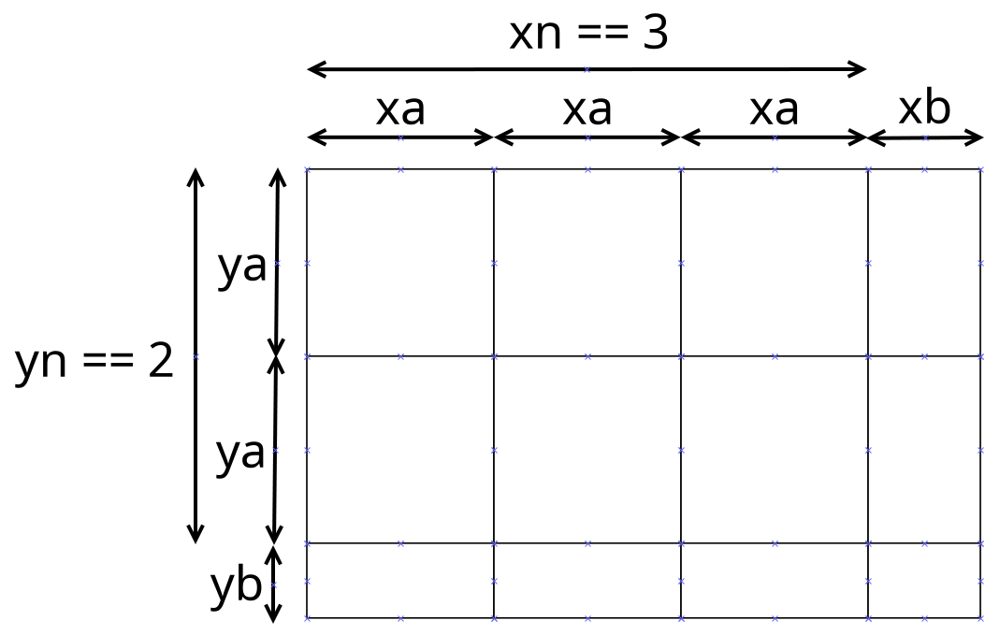

### ICU

Detailed information re ICU should go here.

### MPU

ML relevant information re MPU goes here.

### JPCORE

Do we have enough specific about JPCORE to justify a section?

### Lime

Enough info about Lime to justify section?  Probably just barely, given the power hack for 200D.  Generally devs only need to care about the socket APIs.

### DMA

DMA allows for fast transfers between devices, without using CPU.
Digital photography has a need for high data rates, and portable devices
have low CPU power, so it's no surprise that Canon cams have DMA capabilities.

ML can use MMIO to access two different DMA units.  One does simple copies only,
the other is specialised to allow efficient copying of sub-images out of sensor
data.  We will call the simple unit XDMAC, and the more complex one EDMAC.
EDMAC is known to stand for "Engine DMA Controller".  "Engine" seems to be used
by Canon to refer to something like image processing devices.

### XDMAC

XDMAC was first found by g3gg0 on 600D:\
[https://groups.google.com/g/ml-devel/c/7EJwZIbLfbI](https://groups.google.com/g/ml-devel/c/7EJwZIbLfbI)

On older cams XDMAC has 4 channels, with a struct configured at
0xc0a1\_0000 + (0x10000 * chan\_index).  Details of the transfer are setup,
then the control register is set, and the transfer starts.

Newer cams have more channels (200D has 8), and the MMIO address has moved,
possibly to 0xc920\_0000 region, although this is not yet confirmed.

Code working with this device can be clearly seen in dma\_memcpy().

There are several APIs for accessing XDMAC, the one used in stubs is named "dma\_memcpy".
This variant is blocking.  A variant exists that takes a CBR, for an async copy that signals when
it completes.  Older ML docs discuss this variant, but current ML code doesn't use it.

When calling dma\_memcpy(), DMA setup code behaves differently depending on properties
of the memory block for dst and/or src.  This may include whether the memory is
Cacheable or Uncacheable, or alignment of the block.  The difference in performance
can be significant, and which factors are most important vary by cam.

XDMAC is not used much by ML, because EDMAC can do the same job, typically has a
faster copy speed, and in addition, can be used efficiently for e.g. copying a cropped
region during image capture, whereas XDMAC can only do simple linear copies.

For reference, the struct starting at 0xc0a1\_0000 looks like this:

```
struct xdmac_mmio
{
    uint32_t control_reg; // 0x1 to enable, 0x8000_0000 to reset and disable
    uint32_t unk_01; // unknown, written with 0x00 on DMA setup (2 LSB must be 0,
                     // others dont care)
    uint32_t control_bits;
    uint32_t unk_02;
    uint32_t unk_03;
    uint32_t unk_04;
    uint32_t src;
    uint32_t dst;
    uint32_t count; transfer count (ignoring 2 LSB)
}
// control_bits affects behaviour of the transfer:
// -------- ------1- -------- -------1   written to start transfer
// -------- -------- -------- -------1   start transfer
// -------- -------- -------- ---1----   decrease source address
// -------- -------- -------- --1-----   dont modify source address
// -------- -------- -------- -1------   decrease destination address
// -------- -------- -------- 1-------   dont modify destination address
// -------- -------1 -------- --------   gets set when (delta(source,dest) & 0x1F) == 0
// -------- ------1- -------- --------   set when starting transfer. enable interrupt flag?
// 1------- -------- -------- --------   reverse words LE<->BE
//
// 0x30001 is associated with fast transfers, notably, this means
// dst and src addresses should be aligned to 0x20 with respect to each other.
```

Please note that the comments and behaviour are not tested on all cams.  It is possible
that some cams will use a different struct, or have different meanings for flags, different
requirements for alignment of buffers, etc.

### EDMAC

EDMAC is the "Engine DMA Controller".  Unlike XDMAC, it can efficiently copy a sub-region, which
represents a rectangular image, out of a larger area.  Imagine an image with black borders on
all edges, stored linearly.  EDMAC can be configured to offset a series of copies by the size
of the borders, allowing stripping out the borders at almost the full speed of the memory bus.
Other operations are also possible.

This is a Canon patented part, so the capabilities are well understood:\
[https://www.google.com/patents/US7817297](https://www.google.com/patents/US7817297)

A simplified version of figure 11a from the patent:
{.wide}

The configuration for a copy defines a set of tiles, via a struct defined in edmac.h:

```
struct edmac_info
{
    unsigned int off1a;
    unsigned int off1b;
    unsigned int off2a;
    unsigned int off2b;
    unsigned int off3;
    unsigned int xa;
    unsigned int xb;
    unsigned int ya;
    unsigned int yb;
    unsigned int xn;
    unsigned int yn;
};
```

Tiles can overlap, or have gaps between them, this is controlled by the offset parameters,
and is not shown on the simplified diagram.

The most basic usage is copying a linear run of bytes, for this most fields can be left as 0,
using xn and yn to define a "rectangle" of area equal to the required copy length.  More examples
are given in section 6.

### ADTG

This is a custom part from Analog Devices, specialised for reading out analog image sensors.
We don't know the exact part number, but a part that is likely somewhat similar has a datasheet here:
[https://www.analog.com/media/en/technical-documentation/data-sheets/AD9826.pdf]()

Sensor data capture and amplification are done in the analog domain, fed to an ADC and the results
placed in RAM for use by ICU.

The sensor is read by using precise, configurable timers to control how long to read
each row, column, etc.

The ADTG can be configured from the ICU, which allows the cam to select image size, ISO, etc.
This happens by preparing a buffer with a sequence of command words, and calling a DryOS function
to send to the ADTG.

Command words are 16 or 32 bit, depending on which cam and sub-part of the ADTG is being
controlled.

ML docs sometimes talk about ADTG or CMOS "registers".  This is likely to be confusing terminology.
To understand, you must know that the ADTG part has sub-parts that can be individually configured.
These include, at least, a part dedicated to reading data from the CMOS sensor, an ADC, and
various timers.  Historically, we've called out CMOS control separately, but called everything
else "ADTG".  The "register" term is because some command words have a field for selecting
a register internal to the ADTG.

We use the ADTG for several tasks:
- fine tuning FPS
- selecting image capture size (this includes image displayed in LiveView, crop video)
- dual ISO captures

There have been some attempts to reduce rolling shutter, increase FPS etc - there is
much more exploration left to be done in this area.

You can use the module adtglog2 to log command data to card, in a human readable format
that is similar across different cams.  This helps greatly when porting a feature from
a well supported cam to a new cam.  The command formats tend to change per sensor gen,
which is only weakly linked to Digic gen.

Example command data, logged from a 6D2:
```
CMOS_write, time: 24461,  LR: e0302d23, buf_addr: 415a7ae8
    data: 0d03a440 10717220 21a30100 3c120000 4476520a 50000010 60000021 72000000
          80000008 98210ba0 a0000000 d000e9f1 e00009f1 ffffffff
```
Most of the content here is not understood.  The first word is partially understood,
this commands CMOS register 0xd to sample the sensor at ISO 1600.  The last word
signals the end of the command buffer; this is always -1 in whatever width the
sub-part expects.  `0x0d03a110` would mean ISO 200.

ML can modify behaviour of this command so that e.g. `0x0d03a040` is sent, leading
to alternate lines being sampled at ISO 100 and 1600.

Finding these commands is not too hard; start logging, then exercise the cam
to, e.g., change ISO, and take a picture (changing a setting without using related
functionality may not send the command).  Try two different ISOs, then check the log
for differences.

D45 cams seem to use NZR encoding.

<div style="page-break-after: always; visibility: hidden"></div>
